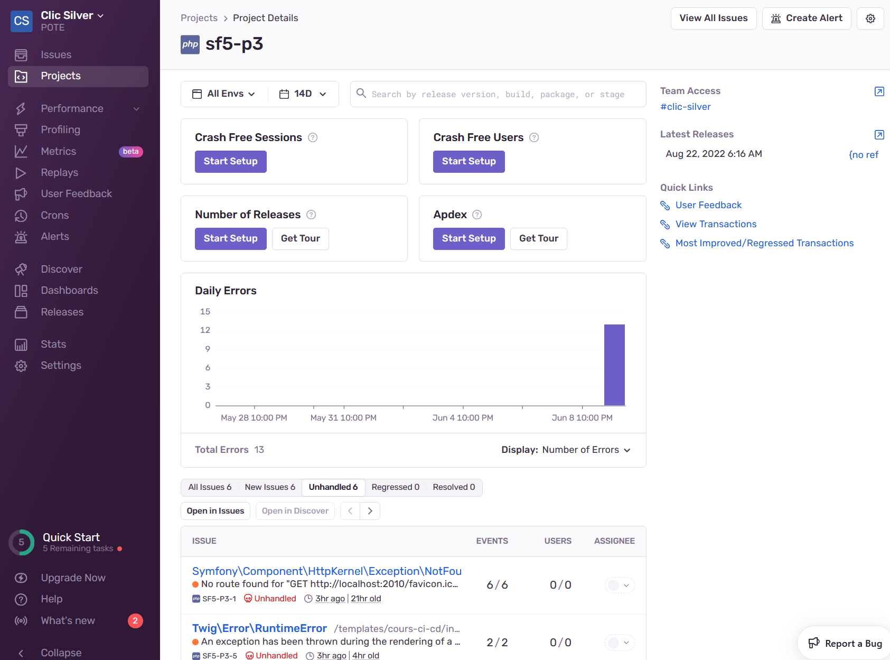
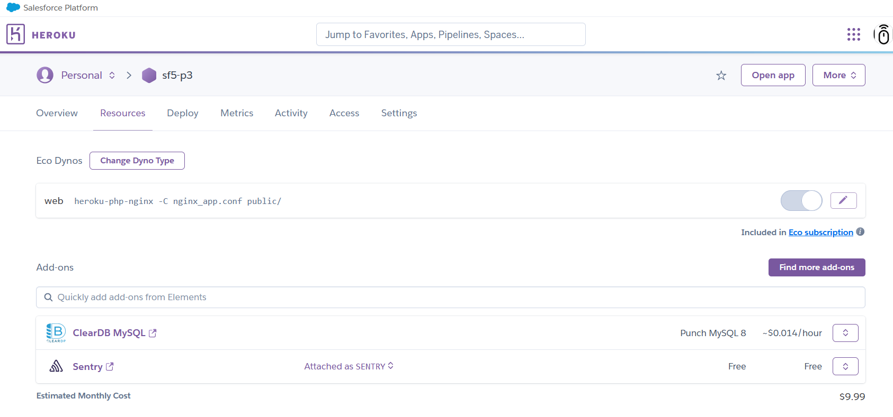
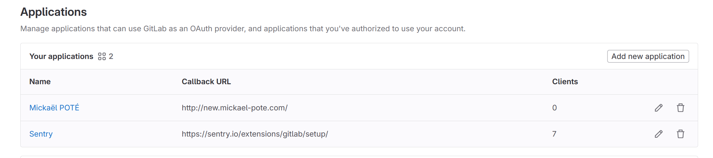

# SF5 Project CI/CD #

## 📝 Objectifs pédagogiques du projet
- Montrer qu'une CI/CD est un processus qui permet d'automatiser les tâches de développement, de test et de déploiement d'une application.
- Montrer que la qualité du code est une priorité dans le processus
- Montrer que la surveillance des erreurs est une constante dans la démarche Agile
- Montrer que l'automatisation des tâches est une priorité dans la démarche DevOps
- L'objectif est de livrer une application de qualité en production en toute sécurité et surtout qui fonctionne
- Appliquer l'esprit DevOps dans le processus de développement d'une application : communication entre les équipes, automatisation des tâches, surveillance des erreurs, etc.


## 📝 Objectifs techniques du projet
- Mettre en place un pipeline CI/CD avec Gitlab CI/CD, SonarCloud, Sentry et Heroku.
- Utiliser Docker pour isoler les applications et leurs dépendances.
- Utiliser GitLab pour gérer les dépôts Git, les pipelines CI/CD, les issues, les merge requests, etc.
- Utiliser SonarCloud pour détecter les bugs, les vulnérabilités et les codes en doublon dans le code source.
- Utiliser Sentry pour surveiller et corriger les erreurs dans les applications en temps réel.
- Utiliser Heroku pour déployer, gérer et mettre à l'échelle des applications.


## 📝 Description du projet
Application Symfony 5.4 Labo pour le projet CI/CD :
L'objectif étant de mettre en place un pipeline CI/CD avec Gitlab CI/CD, SonarCloud, Sentry et Heroku.
Toute la stack Docker nécessaire pour faire fonctionner l'application est déjà prête et présente dans l'application.

##  📑Prérequis pour ce projet [Tous ces outils proposent des formules gratuites]
- Installer Docker Desktop (wSL2 pour Windows | Docker natif pour Linux et MacOS)
- Disposer d'un compte GitLab (gestionnaire de sources centralisé)
- Disposer d'un compte SonarCloud (analyse de code source)
- Disposer d'un compte Sentry (surveillance des erreurs)
- Disposer d'un compte Heroku (plateforme PaaS pour héberger en PROD notre projet)

##  📑Présentation des outils

### Docker Desktop (wSL2 pour Windows | Docker natif pour Linux et MacOS)
- 👉 Moteur permettant de créer des conteneurs Docker pour isoler des applications et leurs dépendances.

- 

### GitLab
- 👉 Plateforme de gestion de dépôts Git, permettant de gérer des projets, des pipelines CI/CD, des issues, des merge requests, etc.

- 

### SonarCloud
- 👉 Outil d'analyse de code source qui permet de détecter les bugs, les vulnérabilités et les codes en doublon dans le code source.

-

### Sentry
- 👉 Outil de surveillance des erreurs qui permet de surveiller et de corriger les erreurs dans les applications en temps réel.

-

#### Heroku
- 👉 Plateforme cloud qui permet de déployer, de gérer et de mettre à l'échelle des applications.

- 
  s
## 📦 Installation
Faire un fork de ce dépôt
- 👉 Le Fork va permettre de travailler sur une copie du projet original, sans modifier le projet original.

- 
- 

Puis cloner le dépôt en local sur votre machine (en partant du lien `clone with HTTPS` depuis la branche ```master```.
- 👉 Le clone va permettre de récupérer le projet sur votre machine locale et surtout d'initialiser le dépôt Git local.

- 
- 👉 Dans votre terminal, exécuter la commande suivante :

```bash
git clone https://gitlab.com/symfony-cast1/sf5-p3.git
```

Une fois le projet cloné, se placer à la racine du projet, ouvrir un terminal puis lancer la commande suivante :
- 👉 Attention il ne s'agit pas d'une commande Docker officielle, mais d'une commande customisée pour ce projet.:
```bash
./start-sf5.sh
```

Une fois les machines Dockers démarrées, entrer dans le container PHP pour disposer de la console PHP :
```bash
./run_sf5_php
```

Une fois dans le container PHP, installer l'application en local avec composer (le gestionnaire de dépendances PHP):
```bash
composer install
```

Toujours dans ce même conteneur PHP : Dupliquer le fichier `.env.local.dist` vers `.env.local`
```bash
cp -p .env.local.dist .env.local
```

Toujours dans ce même conteneur PHP : Jouer les migrations pour `peupler` la base de données
```bash
composer compile
```

## ⚙️Configuration des outils TIERS

### Configuration de GitLab CI/CD

### Configuration de Sentry
### Configuration de SonarCloud
### Configuration de Heroku


## 📑  ️Testing [DEV]

### 1) Création de la BDD de test :

```bash
php bin/console doctrine:database:drop --env=test --if-exists --force
php bin/console doctrine:database:create --env=test

```

### 2) Lancer les tests manuellement dans un terminal :

```bash
php bin/phpunit --testdox
```

### 3) Compiler le theme graphique (optionel)
Si vous voulez modifier les thème CSS, il faudra compiler les style Tailwind avec Webpack.\
Pour cela, installez les vendors javascript :
```bash
yarn install
```


