# SF5 Project CI/CD #

## 📝 Objectifs pédagogiques du projet
- Montrer qu'une CI/CD est un processus qui permet d'automatiser les tâches de développement, de test et de déploiement d'une application.
- Montrer que la qualité du code est une priorité dans le processus
- Montrer que la surveillance des erreurs est une constante dans la démarche Agile
- Montrer que l'automatisation des tâches est une priorité dans la démarche DevOps
- L'objectif est de livrer une application de qualité en production en toute sécurité et surtout qui fonctionne
- Appliquer l'esprit DevOps dans le processus de développement d'une application : communication entre les équipes, automatisation des tâches, surveillance des erreurs, etc.


## 📝 Objectifs techniques du projet
- Mettre en place un pipeline CI/CD avec Gitlab CI/CD, SonarCloud, Sentry et `Heroku`.
- Utiliser Docker pour isoler les applications et leurs dépendances.
- Utiliser GitLab pour gérer les dépôts Git, les pipelines CI/CD, les issues, les merge requests, etc.
- Utiliser SonarCloud pour détecter les bugs, les vulnérabilités et les codes en doublon dans le code source.
- Utiliser Sentry pour surveiller et corriger les erreurs dans les applications en temps réel.
- Utiliser `Heroku` pour déployer, gérer et mettre à l'échelle des applications : **[Facultatif car plan payant mais prix dérisoire]**


## 📝 Description du projet
Application Symfony 5.4 Labo pour le projet CI/CD :
L'objectif étant de mettre en place un pipeline CI/CD avec Gitlab CI/CD, SonarCloud, Sentry et `Heroku`.
Toute la stack Docker nécessaire pour faire fonctionner l'application est déjà prête et présente dans l'application.
- ❗ **Afin de suivre ce README plus facilement je conseille vivement de laisser le nom du projet tel quel : `sf5-p3`**

##  📑Prérequis pour ce projet [Tous ces outils proposent des formules gratuites]
- Installer Docker Desktop (wSL2 pour Windows | Docker natif pour Linux et MacOS)
- Disposer d'un compte GitLab (gestionnaire de sources centralisé)
- Disposer d'un compte SonarCloud (analyse de code source)
- Disposer d'un compte Sentry (surveillance des erreurs)
- Disposer d'un compte `Heroku` (plateforme PaaS pour héberger en `Production` notre projet) : **[Facultatif car plan payant mais prix dérisoire]**
- Disposer de Microsoft Authenticator pour la double authentification sur Heroku (ou tout autre outil de double authentification)
- Disposer d'un IDE (VSCode, PHPStorm, etc.) : je conseille **VSCode** car il est gratuit et très complet, il faut y ajouter les outils pour faire du Dev PHP Symfony (PHP Intelephense, Symfony, etc.)

## 📑Description de la Stack Docker sf5-p3 (micro-services)

Ce projet dispose d'une stack Docker composée de 8 services :

- 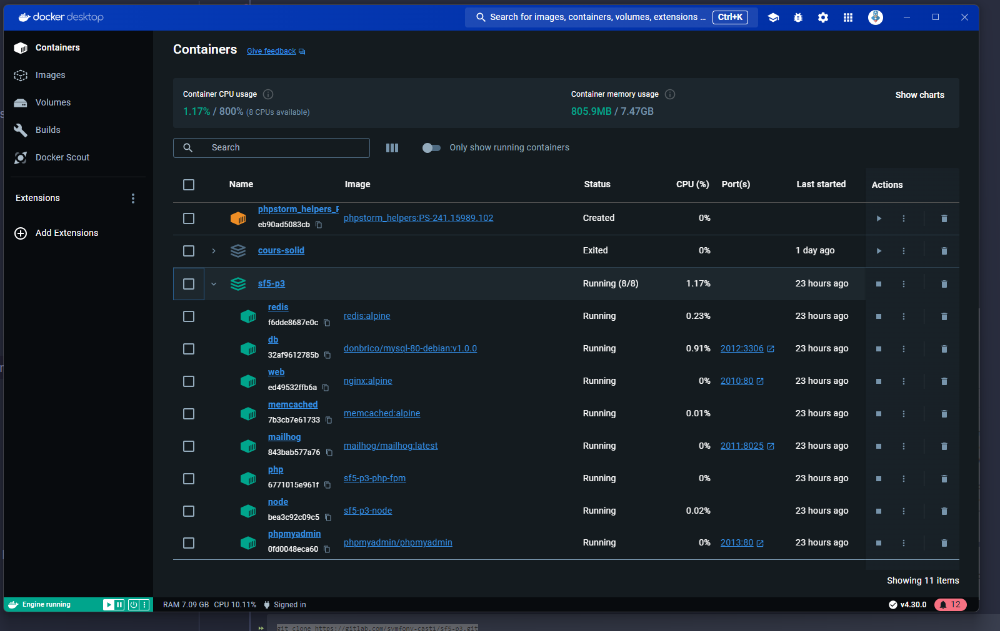

- redis [sf5-p3-redis] : service de cache en mémoire dans une BDD NoSql
- db [sf5-p3-db] : service de base de données sur moteur MySQL
- web [sf5-p3-web] : service de serveur web pour exposer l'application Symfony
- memcached [sf5-p3-memcached] : service de cache en mémoire
- mailhog [sf5-p3-mailhog] : service de serveur SMTP pour intercepter les mails envoyés par l'application
- php [sf5-p3-php] : service PHP pour exécuter les commandes Symfony (Symfony v5.4, PHP 8.1, composer 2)
- node [sf5-p3-node] : service pour compiler les assets CSS/JS
- phpmyadmin [sf5-p3-phpmyadmin] : service de gestion de la base de données MySQL


##  📑Présentation des outils

### Docker Desktop (wSL2 pour Windows | Docker natif pour Linux et MacOS)
- 👉 Moteur permettant de créer des conteneurs Docker pour isoler des applications et leurs dépendances.
- ❗ Attention, `docker CLI` doit être installé sur votre machine pour pouvoir exécuter les commandes Docker. vérifier avec la commande `docker -v` dans votre terminal.
- 👉 Le résultat doit être quelque chose comme : `Docker version 2x.yy.z, build jldmkj` : Si `docker` ET docker CLI n'est pas installé, suivre la documentation officielle pour l'installer.
- ❗ Attention, dans ce cas là, il faut installer Docker Desktop pour Windows ou Docker natif pour Linux et MacOS (bien installer WSL2 pour Windows en prérequis) : https://docs.docker.com/desktop/wsl/

- 

### GitLab
- 👉 Plateforme de gestion de dépôts Git, permettant de gérer des projets, des pipelines CI/CD, des issues, des merge requests, etc.

- 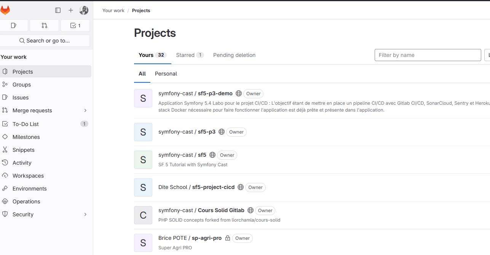

### SonarCloud
- 👉 Outil d'analyse de code source qui permet de détecter les bugs, les vulnérabilités et les codes en doublon dans le code source.

-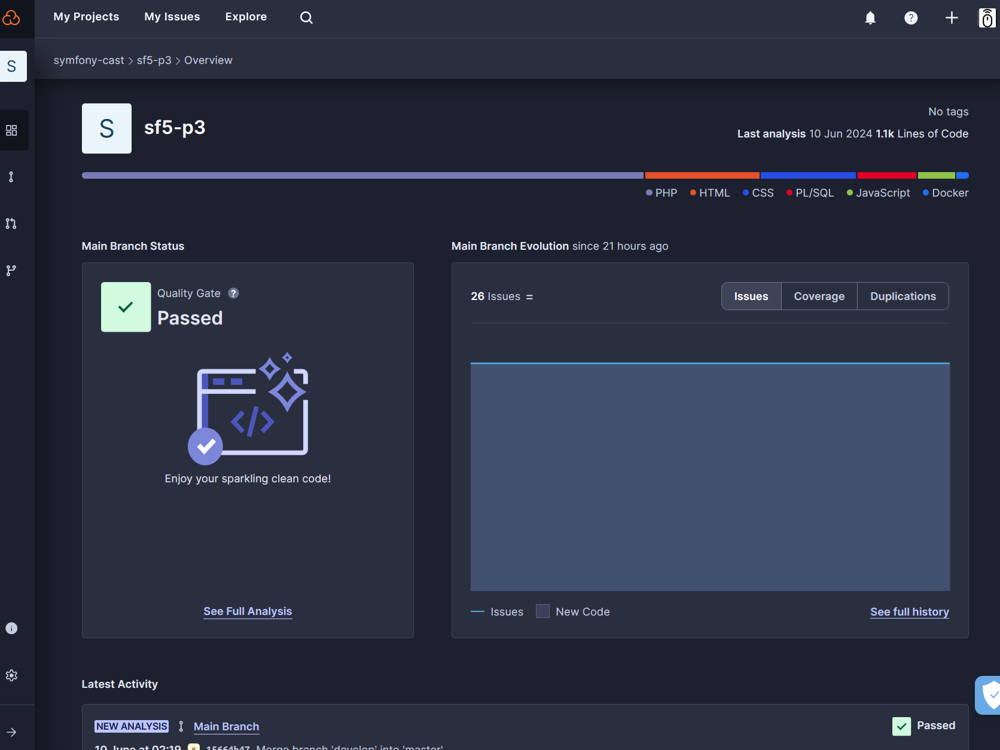

### Sentry
- 👉 Outil de centralisation des erreurs qui permet de surveiller et de corriger les erreurs dans les applications en temps réel.

-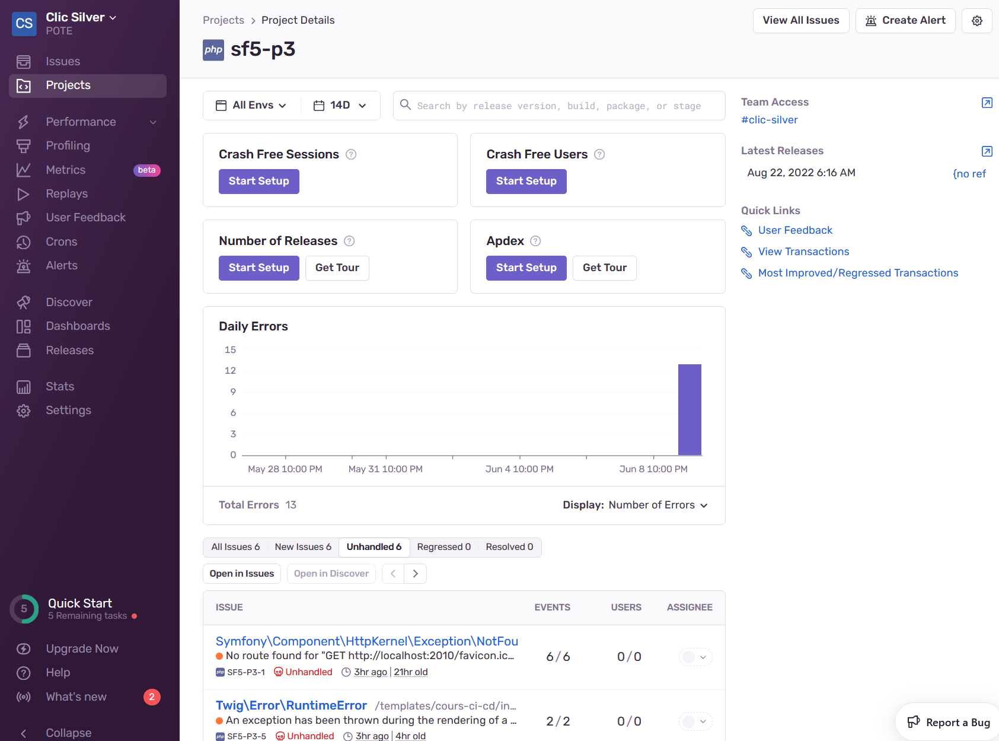

#### Heroku
- 👉 Plateforme cloud qui permet de déployer, de gérer et de mettre à l'échelle des applications.

- 
  


## 📦 Installation
1. Faire un fork de ce dépôt : bien forker le projet en projet avec une visibilité **public** : certain des `outils tiers`, utilisés dans ce projet, nécessitent une visibilité **publique** pour fonctionner.
   - 👉 Le Fork va permettre de travailler sur une copie du projet original, sans modifier le projet original.

   - 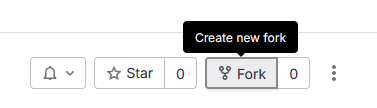
   - 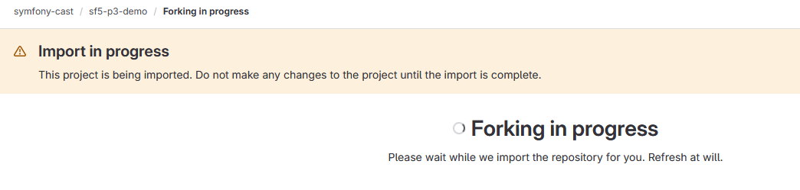

   

2. Sur votre machine local, ne pas faire les tâches en tant que utilisateur `root` mais votre utilisateur `classique` : dans votre **Machine Linux WSL2** ou Terminal Linux sur MacOS ou Linux : vous positionner dans votre "HOME DIRECTORY"
   - ❗ Attention, il est important de bien se placer dans son "~/monusername"
   - Une fois dans son **home directory** : créer le répertoire `www` (attention, il est important de bien respecter la casse)
   - Puis se placer dans le répertoire `www` et cloner le projet depuis votre fork : **votre projet se trouvera dans `~/www/sf5-p3`**
   - Donner les droits `755` ou `777` au répertoire `sf5-p3` pour éviter les problèmes de permissions : 
    ```bash
    sudo chmod -R 777 ~/www/sf5-p3
    ```
   - une fois les droits corrects mis en place, se déplacer dans le dossier en question afin d'y clôner le projet :
    ```bash
    cd sf5-p3
    ```


3. Puis cloner le dépôt en local sur votre machine (en partant du lien `clone with HTTPS` depuis la branche ```master```.
   - 👉 Le clone va permettre de récupérer le projet sur votre machine locale et surtout d'initialiser le dépôt Git local.
   - ❗ Attention, il est important de cloner le projet depuis votre fork et non depuis le projet original.

   - 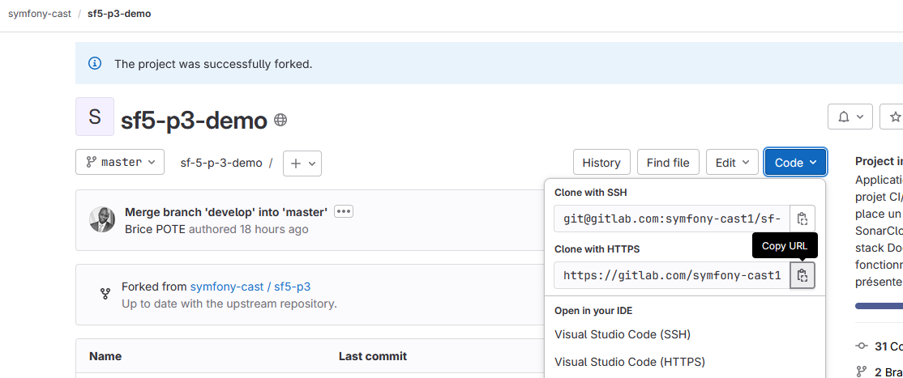
   - 👉 Dans votre terminal, exécuter la commande suivante :

   ```bash
   git clone https://gitlab.com/<votre-groupe-si-besoin>/<votre-propre-repo-forked>/sf5-p3.git
   ```

   Une fois le projet cloné, se placer à la racine du projet, ouvrir un terminal puis lancer la commande suivante :
   - ❗ Attention il ne s'agit pas d'une commande Docker officielle, mais d'une commande customisée pour ce projet.
   ```bash
   ./start-sf5.sh
   ```

   Une fois les machines Dockers démarrées, entrer dans le container PHP pour disposer de la console PHP :
   - ❗ Attention il ne s'agit pas d'une commande Docker officielle, mais d'une commande customisée pour ce projet.
   ```bash
   ./run_sf5_php
   ```

   Toujours dans ce même conteneur PHP : Dupliquer le fichier `.env.local.dist` vers `.env.local`
   ```bash
   cp -p .env.local.dist .env.local
   ```

   Une fois dans le container PHP, installer l'application en local avec composer (le gestionnaire de dépendances PHP):
   ```bash
   composer install
   ```


   Toujours dans ce même conteneur PHP : Jouer les migrations pour `peupler` la base de données
   - 👉 Cette commande va créer la base de données et les tables nécessaires pour le projet et la remplir avec des données tests
   - Cette commande vient du fichier `composer.json` et est une commande personnalisée dans la section `scripts`
   ```bash
   composer compile
   ```
    - ❗ Attention, cette commande va créer la base de données et les tables nécessaires pour le projet et la remplir avec des données tests, donc le container `db` doit être bien démarré pour que cela fonctionne.


## ⚙️Configuration des outils TIERS

### Configuration de GitLab CI/CD


1. Permettre à GitLab de se connecter à Sentry, Heroku et SonarCloud dans le cadre de la Pipeline CI/CD.
   - ❗ Attention, ce projet doit avoir été forké en projet `public` pour que les outils tiers puissent se connecter à GitLab. Penser le cas échéant à vérifier la visibilité du groupe parent si nécessaire, lui aussi doit être en `public`.
   - Se connecter à son compte GitLab, puis aller dans votre projet, puis dans `Settings` > `CI/CD` > `Variables` et ajouter les variables suivantes :
   - 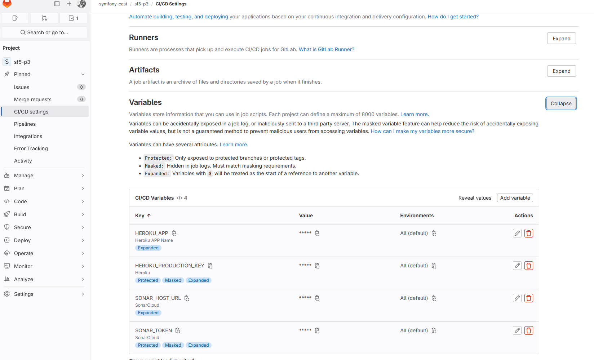

   - Laisser pour l'instant toutes les variables vides, elles seront renseignées plus tard.
     1. HEROKU_APP [Nom de l'application Heroku] : **Visibility** : `Visible` | **Flags** : `Expand variable reference`
     2. HEROKU_PRODUCTION_KEY [Clé API Heroku] : **Visibility** : `Masked` | **Flags** : `Expand variable reference`
     3. SONAR_TOKEN [Token SonarCloud] : **Visibility** : `Visible` | **Flags** : `Expand variable reference`
     4. SONAR_HOST_URL [URL SonarCloud] : **Visibility** : `Visible` | **Flags** : `Expand variable reference`

   - La fonctionnalité de Pipeline CI/CD de GitLab est déjà activée par la présence du fichier **.gitlab-ci.yml** à la racine du projet.

### Configuration de Sentry
- Se connecter à son compte Sentry
- créer un nouveau projet **sf5-p3** basé sur la plateforme `PHP`, laisser`**Set your alert frequency**` à la valeur par défaut (`Alert me on every new issue`)
- puis mettre comme **Project name** : `sf5-p3` et laisser **Team** tel quel puis cliquez sur le bouton **Create Project"**
- dans la section **Configure your SDK**, copier la clé DSN : `https://3cxxxxxxxxxxxxxxxxxx3e@yyyyyyy.ingest.us.sentry.io/zzzzzzzzzzzzzzzz`
- Coller cette clef DSN dans le fichier `.env.local` à la racine du projet, pour la valeur de la variable `SENTRY_DSN`
- La section **Verify** est déjà existante dans le projet dans `src/Controller/SentryTestController.php`
- Suivre les instructions pour connecter Sentry à GitLab CI/CD : https://docs.sentry.io/organization/integrations/source-code-mgmt/gitlab/


- ❗ Attention, à bien exécuter cette partie et lire ATTENTIVEMENT la documentation sous peine de ne pas réussir à connecter Sentry à GitLab CI/CD

- 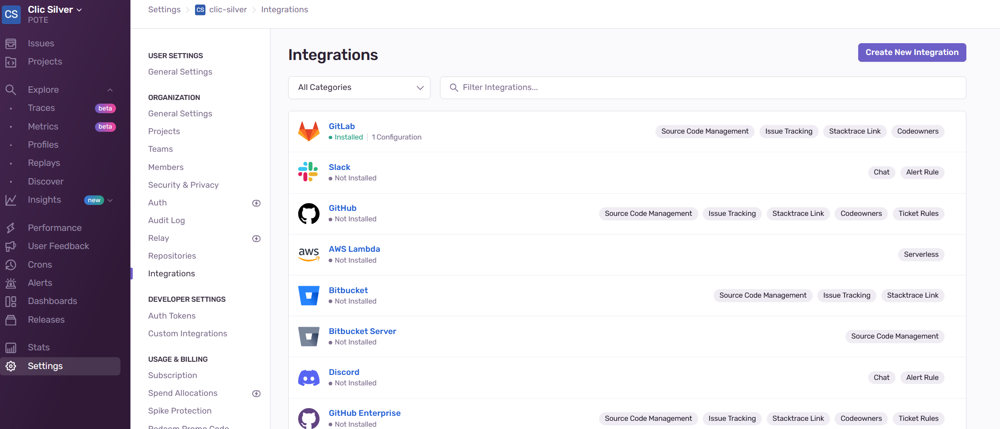

- 
- 
- ❗ Attention, Bien lire la doc de la "popup" qui explique les étapes préalables à la connexion de Sentry à GitLab CI/CD avant d'appuyer sur "Suivant" ou "Next" : si ce n'est pas lu, vous n'arriverez pas à établir la connexion entre Sentry et GitLab CI/CD.


Bien penser à créer l'application dans Gitlab pour Sentry :

- 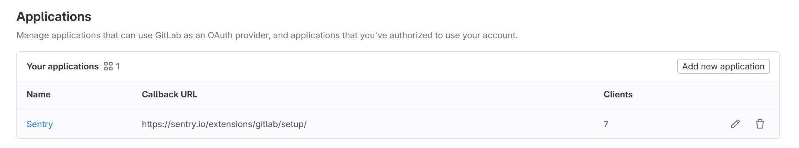

- ❗ Attention, bien utiliser l'url suivante pour dans la partie `Application dans GitLab` : https://sentry.io/extensions/gitlab/setup/ et mettre comme nom d'application `Sentry`, laisser coché `Confidential` et `Read user` et Scopes `api` puis `Save application` pour valider le formulaire

- Ne pas hésiter également à créer un faux incident pour valider l'installation 

- 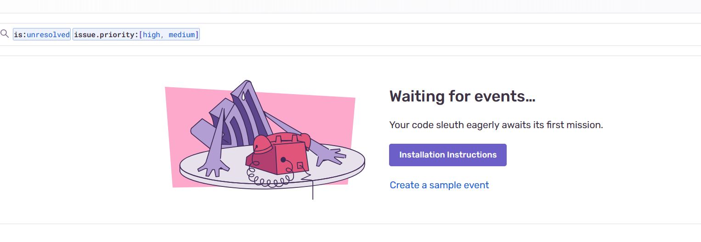

### Configuration de SonarCloud
- Se connecter à son compte SonarCloud
- Connecter SonarCloud à GitLab CI/CD : https://docs.sonarsource.com/sonarcloud/getting-started/gitlab/
- Suivre la connexion du projet SonarCloud à GitLab CI/CD : https://docs.sonarsource.com/sonarcloud/advanced-setup/ci-based-analysis/gitlab-ci/
- ❗ Attention, bien vérifier le contenu du fichier sonar-project.properties à la racine du projet : il doit correspondre aux informations du projet SonarCloud

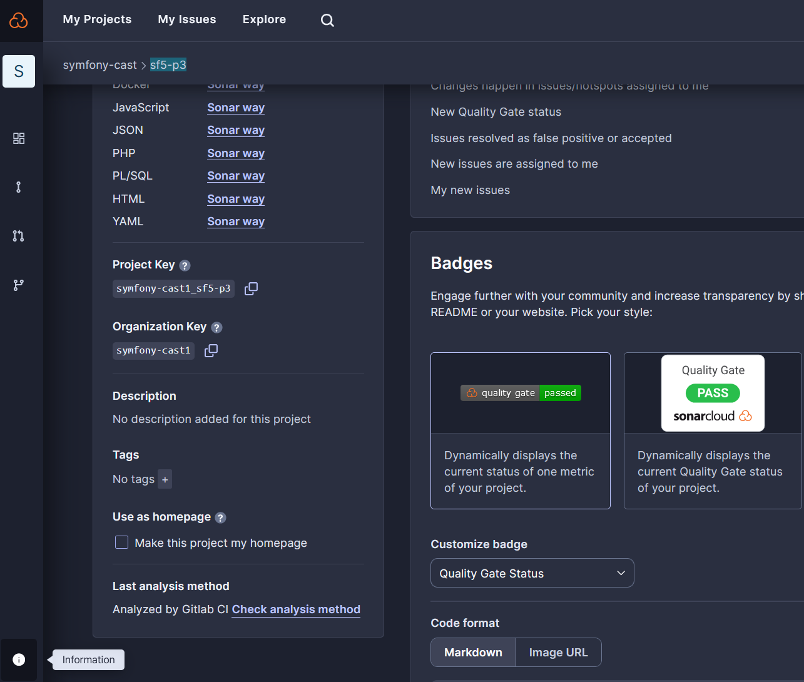

### Configuration de Heroku [Facultatif car plan payant mais prix dérisoire]
- Se connecter à son compte Heroku
- Créer une nouvelle application Heroku : `sf5-p3` pour la région `Europe`, avec le buildpack `heroku/php`, `nodejs`
- Suivre la documentation pour déployer un projet Symfony sur Heroku : https://devcenter.heroku.com/articles/deploying-symfony4
- ❗ Attention, ne pas utiliser `sf5-p3` car cette dernière est déjà utilisée pour le projet (et oui par moi-même 😜), utiliser un autre nom pour l'application Heroku


## 📑  HomeWorks [Travaux notés]
1. Arriver à connecter tous les outils entre eux à l'aide de ce document et d'internet
2. Arriver à faire passer les tests unitaires et fonctionnels dans le pipeline CI/CD
3. Arriver à déployer l'application sur Heroku
4. Arriver à surveiller les erreurs dans Sentry
5. Arriver à détecter les bugs, les vulnérabilités et les codes en doublon dans le code source avec SonarCloud
6. Arriver à faire passer les tests de qualité de code dans le pipeline CI/CD
7. Comment s'assurer quelle version est déployée en production sur Heroku ?
8. Exemple de collaboration entre les équipes Dev et Ops pour résoudre un problème en production
9. Analyser en détail le fichier `gilab-ci.yml` et expliquer chaque étape
10. L'évaluation tient compte également de la participation lors de la séance du TP
11. L'évaluation tient compte également de la faculté à ne pas resté(e) bloqué(e) et à solliciter l'aide de l'intervenant
12. Enfin, une observation plus attentive sur la faculté à ne pas "survoler les instructions" mais à les lire attentivement pour les comprendre et les appliquer (c'est une compétence très recherchée en entreprise)
13. Il manque volontairement certain éléments dans ce document pour vous obliger à chercher par vous-même sur internet et à comprendre les outils que vous utilisez : ne pas hésiter en cas de blocage à me solliciter, je suis là pour vous aider.
