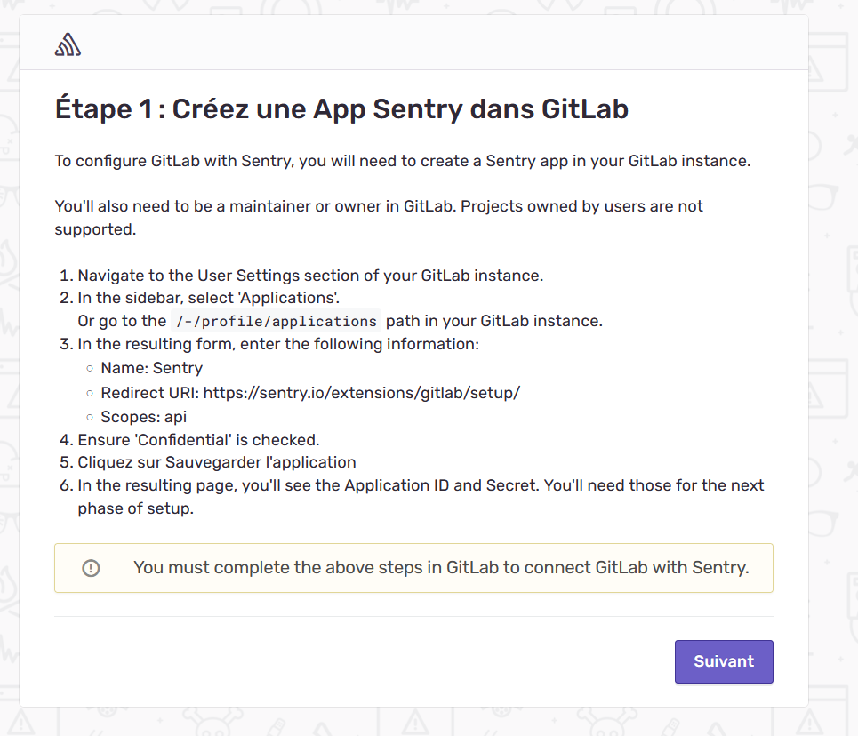
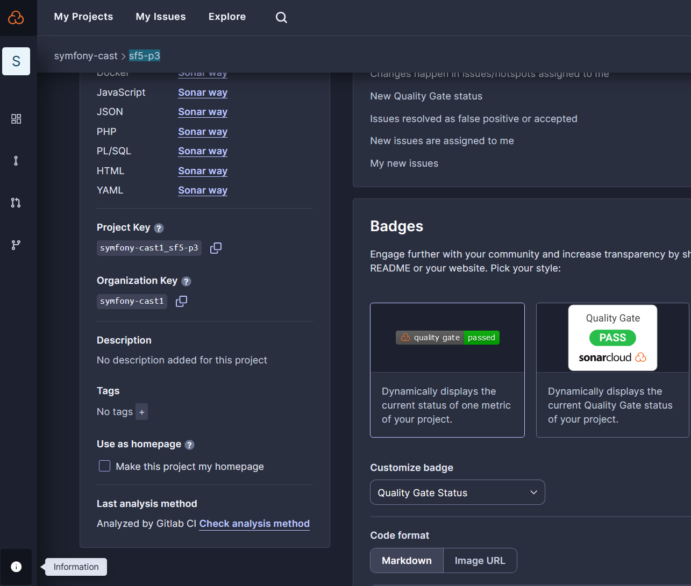
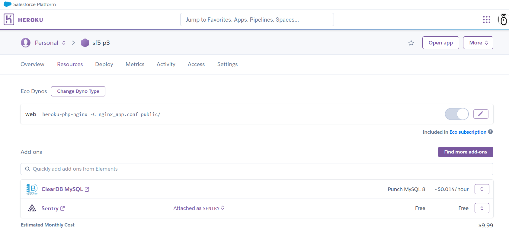
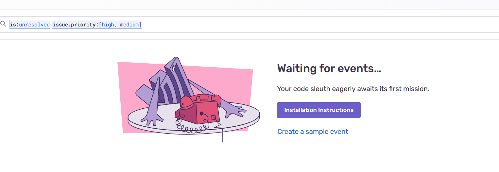
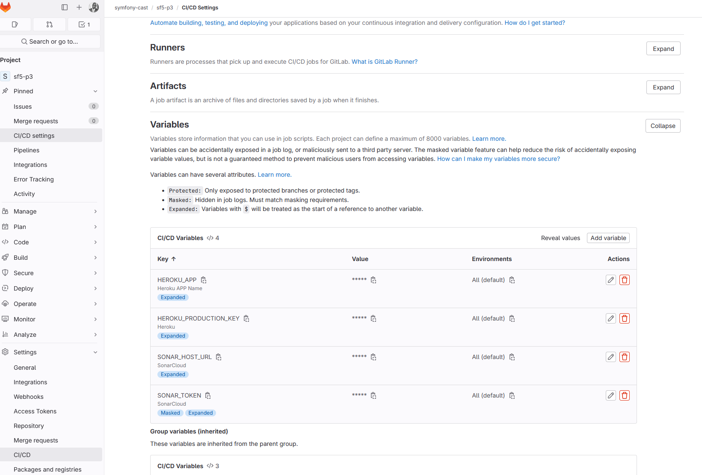

# SF5 Project CI/CD #

## 📝 Objectifs pédagogiques du projet
- Montrer qu'une CI/CD est un processus qui permet d'automatiser les tâches de développement, de test et de déploiement d'une application.
- Montrer que la qualité du code est une priorité dans le processus
- Montrer que la surveillance des erreurs est une constante dans la démarche Agile
- Montrer que l'automatisation des tâches est une priorité dans la démarche DevOps
- L'objectif est de livrer une application de qualité en production en toute sécurité et surtout qui fonctionne
- Appliquer l'esprit DevOps dans le processus de développement d'une application : communication entre les équipes, automatisation des tâches, surveillance des erreurs, etc.


## 📝 Objectifs techniques du projet
- Mettre en place un pipeline CI/CD avec Gitlab CI/CD, SonarCloud, Sentry et Heroku.
- Utiliser Docker pour isoler les applications et leurs dépendances.
- Utiliser GitLab pour gérer les dépôts Git, les pipelines CI/CD, les issues, les merge requests, etc.
- Utiliser SonarCloud pour détecter les bugs, les vulnérabilités et les codes en doublon dans le code source.
- Utiliser Sentry pour surveiller et corriger les erreurs dans les applications en temps réel.
- Utiliser Heroku pour déployer, gérer et mettre à l'échelle des applications.


## 📝 Description du projet    
Application Symfony 5.4 Labo pour le projet CI/CD :
L'objectif étant de mettre en place un pipeline CI/CD avec Gitlab CI/CD, SonarCloud, Sentry et Heroku.
Toute la stack Docker nécessaire pour faire fonctionner l'application est déjà prête et présente dans l'application.
Pour des raisons de facilité, laisser le nom du projet tel quel : `sf5-p3`

##  📑Prérequis pour ce projet [Tous ces outils proposent des formules gratuites]
- Installer Docker Desktop (wSL2 pour Windows | Docker natif pour Linux et MacOS)
- Disposer d'un compte GitLab (gestionnaire de sources centralisé)
- Disposer d'un compte SonarCloud (analyse de code source)
- Disposer d'un compte Sentry (surveillance des erreurs)
- Disposer d'un compte Heroku (plateforme PaaS pour héberger en PROD notre projet)
- Disposer de Microsoft Authenticator pour la double authentification sur Heroku (ou tout autre outil de double authentification)
- Disposer d'un IDE (VSCode, PHPStorm, etc.) : je conseille VSCode car il est gratuit et très complet, il faut y ajouter les outils pour faire du Dev PHP Symfony (PHP Intelephense, Symfony, etc.)

## 📑Description de la Stack Docker sf5-p3 (micro-services)

Ce projet dispose d'une stack Docker composée de 8 services :

- 

- redis [sf5-p3-redis] : service de cache en mémoire dans une BDD NoSql
- db [sf5-p3-db] : service de base de données sur moteur MySQL
- web [sf5-p3-web] : service de serveur web pour exposer l'application Symfony
- memcached [sf5-p3-memcached] : service de cache en mémoire
- mailhog [sf5-p3-mailhog] : service de serveur SMTP pour intercepter les mails envoyés par l'application
- php [sf5-p3-php] : service PHP pour exécuter les commandes Symfony (Symfony v5.4, PHP 8.1, composer 2)
- node [sf5-p3-node] : service pour compiler les assets CSS/JS
- phpmyadmin [sf5-p3-phpmyadmin] : service de gestion de la base de données MySQL


##  📑Présentation des outils

### Docker Desktop (wSL2 pour Windows | Docker natif pour Linux et MacOS)
- 👉 Moteur permettant de créer des conteneurs Docker pour isoler des applications et leurs dépendances.

- 

### GitLab
- 👉 Plateforme de gestion de dépôts Git, permettant de gérer des projets, des pipelines CI/CD, des issues, des merge requests, etc.

- 

### SonarCloud
- 👉 Outil d'analyse de code source qui permet de détecter les bugs, les vulnérabilités et les codes en doublon dans le code source.

-

### Sentry
- 👉 Outil de centralisation des erreurs qui permet de surveiller et de corriger les erreurs dans les applications en temps réel.

-

#### Heroku
- 👉 Plateforme cloud qui permet de déployer, de gérer et de mettre à l'échelle des applications.

- 
s
## 📦 Installation
Faire un fork de ce dépôt
- 👉 Le Fork va permettre de travailler sur une copie du projet original, sans modifier le projet original.

- 
- 

Puis cloner le dépôt en local sur votre machine (en partant du lien `clone with HTTPS` depuis la branche ```master```.
- 👉 Le clone va permettre de récupérer le projet sur votre machine locale et surtout d'initialiser le dépôt Git local.

- 
- 👉 Dans votre terminal, exécuter la commande suivante :

```bash
git clone https://gitlab.com/symfony-cast1/sf5-p3.git
```

Une fois le projet cloné, se placer à la racine du projet, ouvrir un terminal puis lancer la commande suivante :
- ❗ Attention il ne s'agit pas d'une commande Docker officielle, mais d'une commande customisée pour ce projet.
```bash
./start-sf5.sh
```

Une fois les machines Dockers démarrées, entrer dans le container PHP pour disposer de la console PHP :
- ❗ Attention il ne s'agit pas d'une commande Docker officielle, mais d'une commande customisée pour ce projet.
```bash
./run_sf5_php
```

Une fois dans le container PHP, installer l'application en local avec composer (le gestionnaire de dépendances PHP):
```bash
composer install
```

Toujours dans ce même conteneur PHP : Dupliquer le fichier `.env.local.dist` vers `.env.local`
```bash
cp -p .env.local.dist .env.local
```

Toujours dans ce même conteneur PHP : Jouer les migrations pour `peupler` la base de données
- 👉 Cette commande va créer la base de données et les tables nécessaires pour le projet et la remplir avec des données tests
- Cette commande vient du fichier `composer.json` et est une commande personnalisée dans la section `scripts`
```bash
composer compile
```

## ⚙️Configuration des outils TIERS

### Configuration de GitLab CI/CD
Permettre à GitLab de se connecter à Sentry, Heroku et SonarCloud dans le cadre de la Pipeline CI/CD.
Se connecter à son compte GitLab, puis aller dans votre projet, puis dans `Settings` > `CI/CD` > `Variables` et ajouter les variables suivantes :
- 

Laisser pour l'instant toutes les variables vides, elles seront renseignées plus tard.
1. HEROKU_APP [Nom de l'application Heroku] : **Visibility** : `Visible` | **Flags** : `Expand variable reference`
2. HEROKU_PRODUCTION_KEY [Clé API Heroku] : **Visibility** : `Masked` | **Flags** : `Expand variable reference`
3. SONAR_TOKEN [Token SonarCloud] : **Visibility** : `Visible` | **Flags** : `Expand variable reference`
4. SONAR_HOST_URL [URL SonarCloud] : **Visibility** : `Visible` | **Flags** : `Expand variable reference`

La fonctionnalité de Pipeline CI/CD de GitLab est déjà activée par la présence du fichier **.gitlab-ci.yml** à la racine du projet.

### Configuration de Sentry
1. Se connecter à son compte Sentry
2. créer un nouveau projet **sf5-p3** basé sur la plateforme `PHP`, laisser`**Set your alert frequency**` à la valeur par défaut (`Alert me on every new issue`) 
puis mettre comme **Project name** : `sf5-p3` et laisser **Team** tel quel puis cliquez sur le bouton **Create Project"**
3. dans la section **Configure your SDK**, copier la clé DSN : `https://3cxxxxxxxxxxxxxxxxxx3e@yyyyyyy.ingest.us.sentry.io/zzzzzzzzzzzzzzzz`
4. Coller cette clef DSN dans le fichier `.env.local` à la racine du projet, pour la valeur de la variable `SENTRY_DSN`
5. La section **Verify** est déjà existante dans le projet dans `src/Controller/SentryTestController.php`
6. Suivre les instructions pour connecter Sentry à GitLab CI/CD : https://docs.sentry.io/organization/integrations/source-code-mgmt/gitlab/

### Configuration de SonarCloud
1. Se connecter à son compte SonarCloud
2. Connecter SonarCloud à GitLab CI/CD : https://docs.sonarsource.com/sonarcloud/getting-started/gitlab/
3. Suivre la connexion du projet SonarCloud à GitLab CI/CD : https://docs.sonarsource.com/sonarcloud/advanced-setup/ci-based-analysis/gitlab-ci/

### Configuration de Heroku
1. Se connecter à son compte Heroku
2. Créer une nouvelle application Heroku : `sf5-p3` pour la région `Europe`, avec le buildpack `heroku/php`, `nodejs`
3. Suivre la documentation pour déployer un projet Symfony sur Heroku : https://devcenter.heroku.com/articles/deploying-symfony4


## 📑  HomeWorks [Travaux notés]
1. Arriver à connecter tous les outils entre eux à l'aide de ce document et d'internet
2. Arriver à faire passer les tests unitaires et fonctionnels dans le pipeline CI/CD
3. Arriver à déployer l'application sur Heroku
4. Arriver à surveiller les erreurs dans Sentry
5. Arriver à détecter les bugs, les vulnérabilités et les codes en doublon dans le code source avec SonarCloud
6. Arriver à faire passer les tests de qualité de code dans le pipeline CI/CD
7. Comment s'assurer quelle version est déployée en production sur Heroku ?
8. Exemple de collaboration entre les équipes Dev et Ops pour résoudre un problème en production
9. Analyser en détail le fichier `gilab-ci.yml` et expliquer chaque étape
